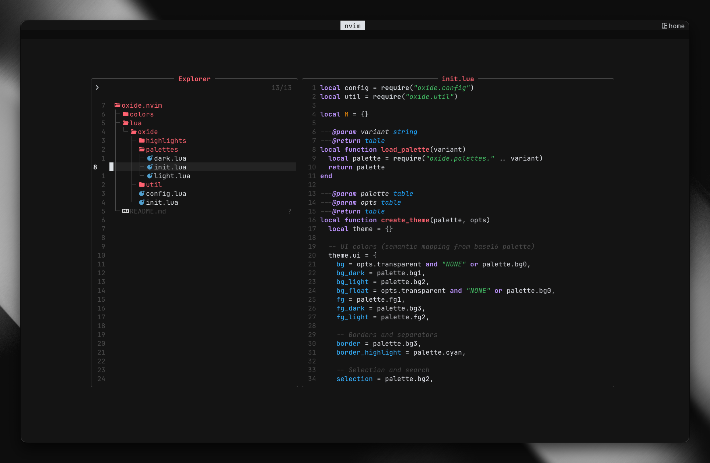
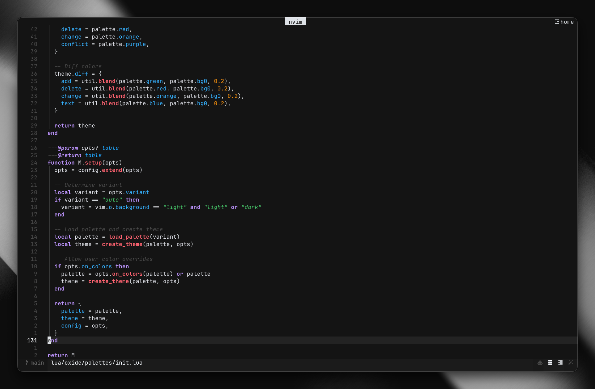

<div align="center">
  
# oxide

</div>

<h6 align="center">
Where function meets form.
</h6>

<p align="center">
  <a href="https://github.com/oxidescheme/oxide.nvim/stargazers"></a>
  <a href="https://github.com/oxidescheme/oxide.nvim/releases/latest"></a>
  <a href="https://github.com/oxidescheme/oxide.nvim/issues"></a>
  <a href="https://www.lua.org/"></a>
</p>

<p align="center">
  
</p>

<p align="center">
  
</p>

<p>
<b>oxide.nvim</b> brings the oxide colorscheme to Neovim with full TreeSitter and LSP support.
Built around clarity and restraint, it uses a deep near-black background, crisp white foregrounds, and soft pastel accents to emphasize structure without visual noise.
</p>

## Features

- **Dual variants**: Dark and light themes that adapt to any environment
- **TreeSitter ready**: Full support for modern syntax highlighting  
- **LSP integrated**: Semantic highlighting that respects language servers
- **Base16 compliant**: Consistent colors across all your tools
- **Customizable**: Override colors and highlights to match your workflow
- **Performance focused**: Lazy-loaded with minimal startup impact

## Installation

### [lazy.nvim](https://github.com/folke/lazy.nvim)

```lua
{
  "oxidescheme/oxide.nvim",
  lazy = false,
  priority = 1000,
  config = function()
    require("oxide").setup({
      variant = "auto", -- "dark", "light", or "auto"
    })
    vim.cmd.colorscheme("oxide")
  end,
}
```

### [packer.nvim](https://github.com/wbthomason/packer.nvim)

```lua
use {
  "oxidescheme/oxide.nvim",
  config = function()
    require("oxide").setup()
    vim.cmd.colorscheme("oxide")
  end
}
```

### [vim-plug](https://github.com/junegunn/vim-plug)

```vim
Plug 'oxidescheme/oxide.nvim'
```

```lua
require("oxide").setup()
vim.cmd.colorscheme("oxide")
```

## Usage

```lua
-- Basic usage
vim.cmd.colorscheme("oxide")

-- Or use the lua API
require("oxide").load()
```

## Configuration

oxide.nvim comes with sensible defaults, but every aspect can be customized. We won't judge if you spend three hours tweaking hex codes anyway.

```lua
require("oxide").setup({
  variant = "auto", -- "dark", "light", "auto" (follows vim.o.background)
  transparent = false, -- Enable transparent background
  terminal_colors = true, -- Configure terminal colors
  
  styles = {
    comments = { italic = true },
    keywords = { bold = true },
    functions = { bold = true },
    variables = {},
    strings = { italic = true },
    booleans = {},
    numbers = {},
  },
  
  -- Override colors
  on_colors = function(colors)
    colors.red = "#ff0000" -- Make red more intense
  end,
  
  -- Override highlight groups
  on_highlights = function(highlights, colors)
    highlights.Comment = { fg = colors.green, italic = true }
  end,
})
```

### Configuration Options

| Option | Default | Description |
|--------|---------|-------------|
| `variant` | `"auto"` | Theme variant: `"dark"`, `"light"`, or `"auto"` |
| `transparent` | `false` | Enable transparent background |
| `terminal_colors` | `true` | Set terminal colors |
| `styles` | `{}` | Style overrides for syntax groups |
| `on_colors` | `nil` | Function to override color palette |
| `on_highlights` | `nil` | Function to override highlight groups |

## Advanced Usage

### Manual Theme Switching

```lua
-- Switch to dark variant
require("oxide").load({ variant = "dark" })

-- Switch to light variant  
require("oxide").load({ variant = "light" })

-- Auto-detect based on vim.o.background
require("oxide").load({ variant = "auto" })
```

### Custom Styles

```lua
require("oxide").setup({
  styles = {
    -- Remove all styling
    comments = {},
    -- Make functions stand out more
    functions = { bold = true, italic = true },
    -- Subtle variables
    variables = { italic = true },
  }
})
```

### Integration with Other Plugins

oxide.nvim works seamlessly with popular plugins. No extra configuration required, which is a rare treat in the Neovim ecosystem.

- **[lualine](https://github.com/nvim-lualine/lualine.nvim)**: Built-in oxide theme
- **[nvim-tree](https://github.com/kyazdani42/nvim-tree.lua)**: Properly styled file explorer
- **[telescope](https://github.com/nvim-telescope/telescope.nvim)**: Clean search interface
- **[gitsigns](https://github.com/lewis6991/gitsigns.nvim)**: Clear git indicators
- **[snacks](https://github.com/folke/snacks.nvim)**: Clean and minimal fuzzy picker

## Contributing

We follow the same philosophy as the main oxide project: minimalism doesn't mean stagnation. Though if you're here to add rainbow unicorn mode, maybe reconsider.

- Report bugs and request features through [GitHub Issues](https://github.com/oxidescheme/oxide.nvim/issues)
- PRs that delete more lines than they add are especially welcome
- Ensure new highlight groups serve a clear functional purpose

## License

MIT License - see [LICENSE](LICENSE) for details.

## Acknowledgments

- **[oxocarbon.nvim](https://github.com/nyoom-engineering/oxocarbon.nvim)**: Inspiration for minimalist design

<p align="center">
Copyright &copy; 2025-present oxidescheme
</p>
